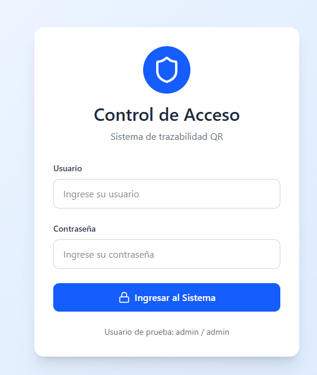
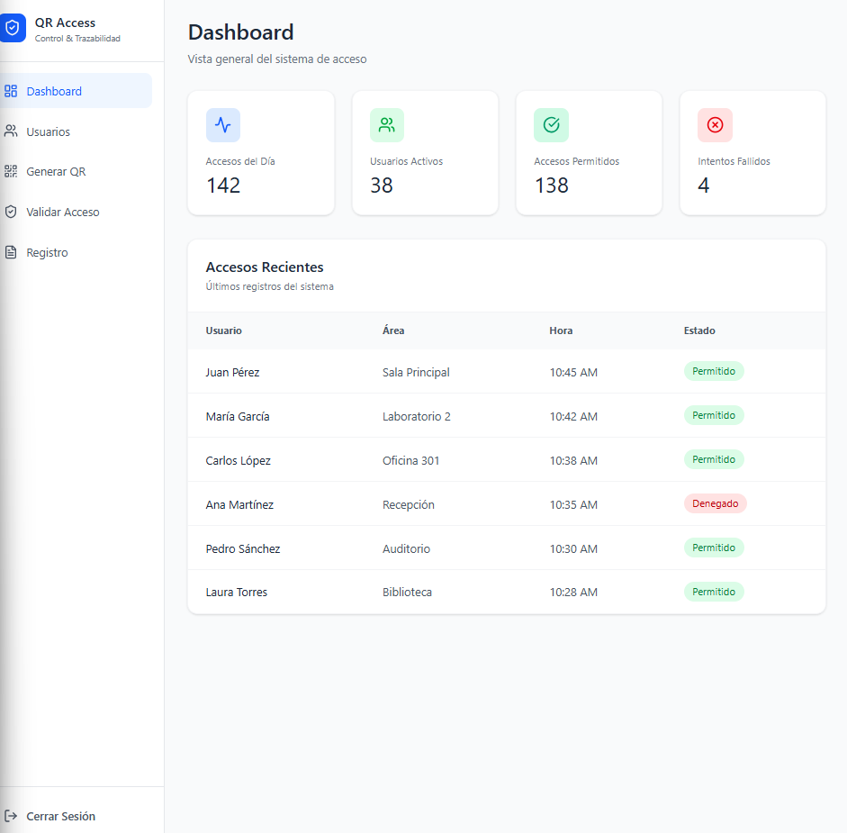
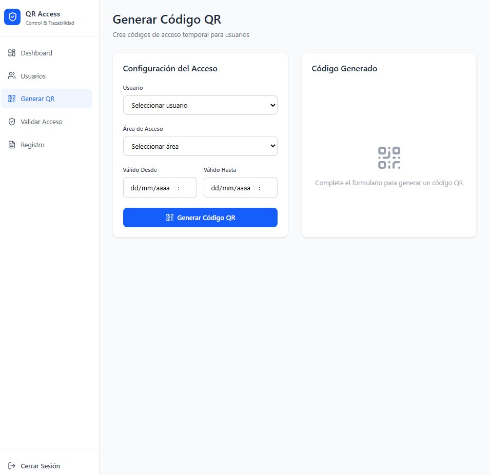
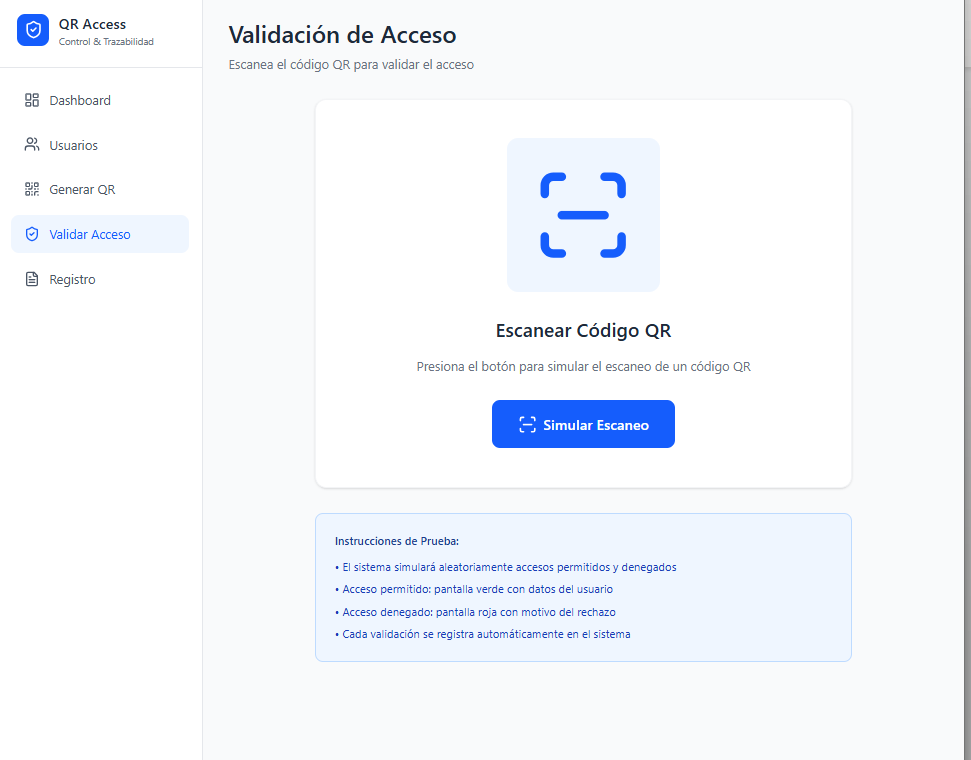
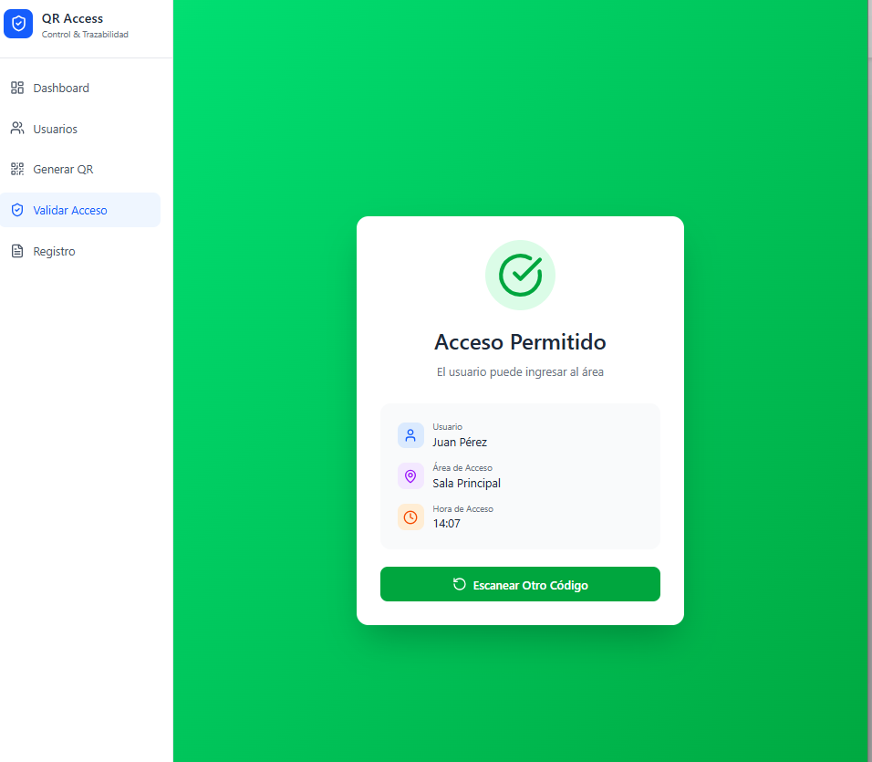
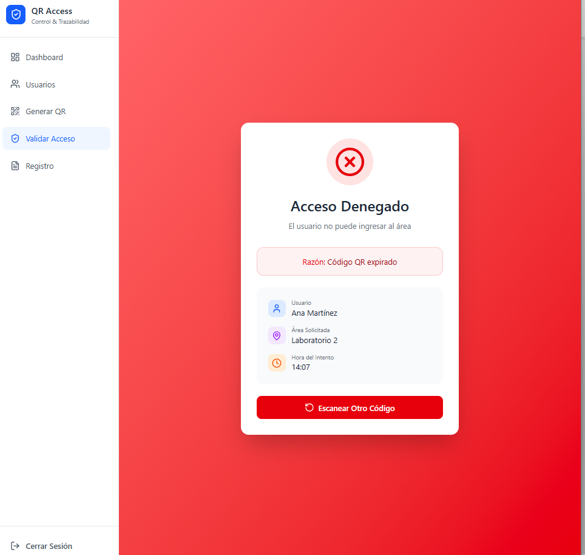
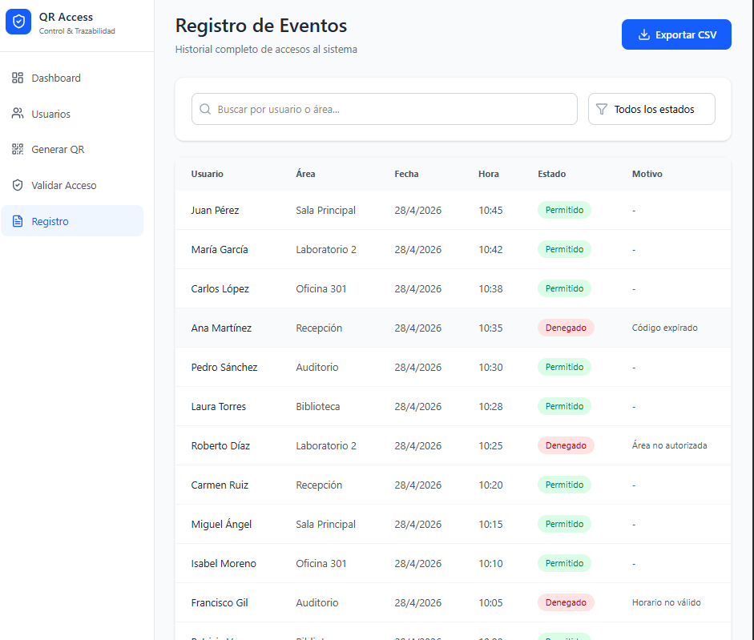

#  Sistema de Control de Acceso con QR

##  Descripción

Este proyecto consiste en el diseño de un prototipo funcional de una plataforma de control de acceso y trazabilidad basada en códigos QR para edificios institucionales.

El sistema permite gestionar usuarios, generar credenciales QR y validar accesos en tiempo real, garantizando la trazabilidad de los eventos.

---

##  Objetivo

Desarrollar un sistema que optimice el control de acceso, mejore la seguridad y permita la auditoría de eventos mediante el uso de tecnologías digitales.

---

##  Funcionalidades

* Autenticación de usuarios
* Gestión de usuarios y roles (RBAC)
* Generación de códigos QR
* Validación de accesos
* Registro de eventos
* Dashboard con métricas

---

##  Nivel de madurez tecnológica

El prototipo alcanza un nivel **TRL5**, ya que ha sido validado en un entorno simulado mediante un prototipo interactivo desarrollado en Figma.

---

##  Prototipo interactivo

https://snore-drawer-78570141.figma.site

---

##  Evidencias

### Login

### Dashboard

### Gestión de usuarios

### Generación de QR

### Validación de acceso

### Acceso permitido

### Acceso denegado

### Registro de eventos

---

##  Integrantes

* Julio Cesar Franco Castro
* Junior Andres Montoya Corrales
* Mirna Elisa Vásquez Escobar

---

##  Universidad

Universidad Nacional Abierta y a Distancia (UNAD)
Ingeniería de Sistemas

---

##  Año

2026
